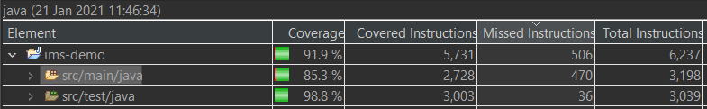
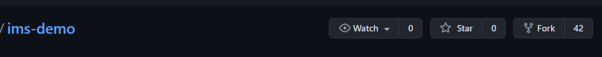
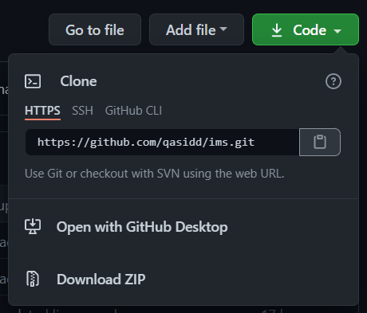
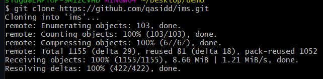
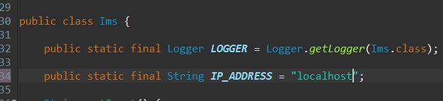
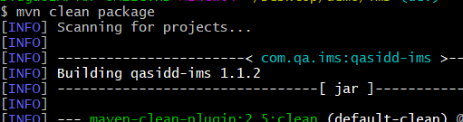
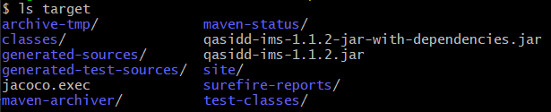

Coverage: 85.3% on src/main/java

# Inventory Management System (IMS)

A CRUD application that allows interaction via a command-line interface. Currently will try to connect to a now defunct remote MySQL instance using JDBC, and create/use a database called 'ims'.

The database comprises of three tables called Customers, Items and Orders, as well as an intermediary table named Orders_Items, created to handle the many-to-many relationship between Items and Orders.

## Getting Started

These instructions will get you a copy of the project up and running on your local machine for development and testing purposes. See deployment for notes on how to deploy the project on a live system.

### Prerequisites

[JDK 8 or over](https://www.oracle.com/java/technologies/javase-jre8-downloads.html)

[Maven](http://maven.apache.org/download.cgi)

[MySQL](https://dev.mysql.com/downloads/mysql/5.7.html)

[Git](https://git-scm.com/downloads)

#### Dependencies (already added to the pom.xml):

[MySQL Connector](https://mvnrepository.com/artifact/mysql/mysql-connector-java)

[Apache Log4j](https://mvnrepository.com/artifact/log4j/log4j)

[Apache Commons IO](https://mvnrepository.com/artifact/commons-io/commons-io)

[JUnit](https://mvnrepository.com/artifact/junit/junit)

[Mockito Core](https://mvnrepository.com/artifact/org.mockito/mockito-core)

### Installing

To create a copy of this repository in to your local machine:

1. Fork this repository to your account

2. Using Git Bash, clone it to your local machine to a directory of your choosing

3. Open the repo using your chosen IDE
4. Currently the program will try to connect, and either create or read a database named `ims`, to a now defunct remote MySQL instance; to fix this, replace the value of `IP_ADDRESS` in the `Ims` class to a working one

5. The project is now ready for development and testing!

## Running the tests

All testing of this program was done using unit tests. Unit testing is a software testing method that isolates individual units of the software, and validates whether each of them performs as designed. These units are considered to be the smallest testable parts of an application. JUnit and Mockito were used to write the tests.

To deploy tests using Maven, simply run `mvn clean test` in the root directory of your local repository.

## Deployment

Make sure the value of `IP_ADDRESS` is accurate before packaging and distributing!

To create a self-contained executable JAR using Maven:

1. Open the directory containing the repository in a terminal
2. Run `mvn clean package`

3. If all tests pass and no hiccups occur, the JAR file will be located in the target folder. The file that ends with `-with-dependencies` will not require a user to have the necessary dependencies in their system to run the executable

## Built With

* [Java 8](https://www.oracle.com/java/)
* [Maven](https://maven.apache.org/) - Dependency Management
* [MySQL](https://www.mysql.com/) - RDBMS
* [Git](https://git-scm.com/) - Version Control System
* [JUnit](https://junit.org/junit4/) & [Mockito](https://site.mockito.org/) - Testing
* [Jira](https://www.atlassian.com/software/jira) - Project Management
* [GCP](https://cloud.google.com/) - Database Host

## Authors

* **Chris Perrins** - *Initial work* - [christophperrins](https://github.com/christophperrins)
* **Siddhartha Gurung** - *The rest*

## License

This project is licensed under the MIT license - see the [LICENSE.md](LICENSE.md) file for details 

## Acknowledgments

* Team Trap
* Vinesh
* Aswene
* Nick
